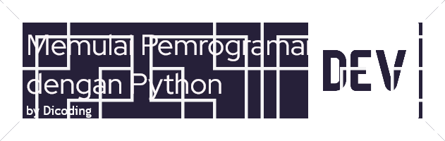

Pelajari dasar pemrograman Python hingga library populer yang menjadi landasan tren industri seperti data science dan machine learning.
 
# Deskripsi 

Python adalah bahasa pemrograman interpretatif yang dapat digunakan di berbagai platform dengan filosofi perancangan yang berfokus pada tingkat keterbacaan kode. Python merupakan bahasa populer yang berkaitan dengan **Data Science** dan **Machine Learning**. Keunggulan Python yang bersifat interpretatif juga banyak digunakan untuk:

- Prototyping
- Scripting dalam pengelolaan infrastruktur
- Pembuatan website berskala besar

Dengan kemudahan yang ditawarkan, Python sering dijadikan bahasa pertama untuk belajar pemrograman.

### Keunggulan Python
1. **Wajib dipelajari** untuk Anda yang ingin memahami dasar-dasar pemrograman, mulai dari scripting, pengolahan data, hingga machine learning.
2. **Digunakan secara luas** dan termasuk dalam bahasa pemrograman paling populer beberapa tahun terakhir.
3. **Pustaka (library) yang luas**, memungkinkan pengembangan ke berbagai bidang. Beberapa library/framework populer:
   - Scikit-Learn
   - TensorFlow
   - PyTorch
4. **Kurva pembelajaran (learning-curve) landai**, cocok untuk pemula dengan sintaksis yang mudah dipelajari.

## Target dan Sasaran Siswa

### Untuk Siapa Kelas Ini?
- Pemula yang ingin belajar dasar pemrograman Python dengan mengacu pada standar industri.
- Siswa yang melek IT dan dapat mengoperasikan komputer dengan baik.

### Prasyarat
- Tidak ada prasyarat khusus dalam pemahaman pemrograman sebelumnya.
- Pengetahuan matematika dasar dan logika pemrograman akan mempermudah pembelajaran.
- **Sikap belajar**: mandiri, berkomitmen, memiliki rasa ingin tahu, dan tertarik pada materi.

### Hasil Pembelajaran
Di akhir kelas, siswa akan mampu:
- Membuat program dengan Python.
- Menggunakan berbagai IDE seperti:

---

**Mulai perjalanan pemrograman Python Anda sekarang!** 🚀